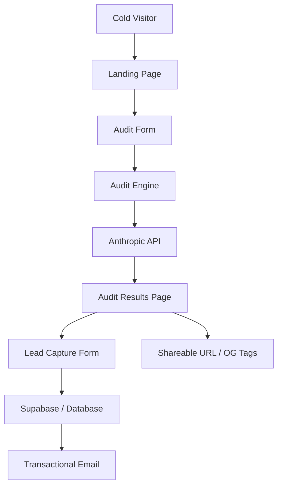

# System Architecture - SpendWise

## System Diagram

## Data Flow
1. **Input**: User provides AI tool stack (Plan, Seats, Spend), Team Size, and Use Case via a multi-step form.
2. **Analysis**: The `Audit Engine` (client-side logic) compares inputs against `PRICING_DATA.md` and optimization rules.
3. **Personalization**: A summary is generated via LLM (Anthropic API) based on the audit findings.
4. **Persistence**: The audit result is stored with a unique UUID. Lead data is captured and linked.
5. **Viral Loop**: Public URLs are generated with dynamic Open Graph tags for social sharing.

## Tech Stack Choice
- **Framework**: Next.js (App Router) - Chosen for SSR (SEO/OG Tags), Server Actions (Lead storage), and rapid deployment.
- **Styling**: Tailwind CSS & Shadcn/UI - To achieve the "Premium" aesthetic with minimal overhead.
- **Database**: Supabase - Real-time storage and easy lead management.
- **AI**: Anthropic API (Claude) - High-quality personalized audit summaries.

## Scalability (10k Audits/Day)
If we hit 10k audits/day, I would:
1. **Caching**: Cache audit results for unique stacks to reduce LLM calls.
2. **Edge Functions**: Move audit logic to the edge for lower latency globally.
3. **Queueing**: Use a message queue (e.g., Upstash QStash) for email delivery to handle bursts.
4. **Rate Limiting**: Implement stricter IP-based rate limiting on the audit generation endpoint.
